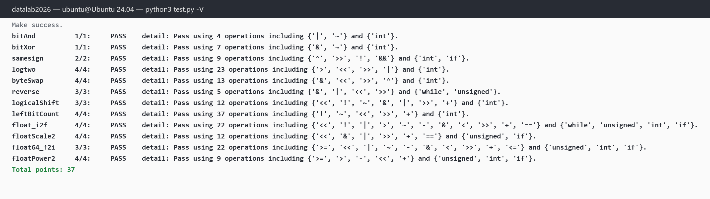

# datalab 报告

姓名：Kerry Chia

学号：（请自行补填）

| 总分 | bitAnd | bitXor | samesign | logtwo | byteSwap | reverse | logicalShift | leftBitCount | float_i2f | floatScale2 | float64_f2i | floatPower2 |
| --------- | ------------- | ------------- | ------------- |----------------- |-----------| ----------- | ----------- | ----------- | ----------- | ----------- | ----------- | ----------- |
| 37 / 37 | 1 / 1 | 1 / 1 | 2 / 2 | 4 / 4 | 4 / 4 | 3 / 3 | 3 / 3 | 4 / 4 | 4 / 4 | 4 / 4 | 3 / 3 | 4 / 4 |

test 截图（`python3 test.py -V`，显示每题实际使用的操作符与次数）：



## 解题报告

### 亮点

我认为最值得展开的三个实现（按"踩坑价值"排序，展开见后文）：

1. **leftBitCount** —— 第一版按"数 `~x` 左端 0"的转化实现，被 btest 抓出负数边界用例后改为对 `x` 直接二分。
2. **reverse** —— 本题合法操作符里没有 `<` `>`，常见写法 `while (i < 32)` 会直接被判违规；改用无符号计数器回绕控制循环，静态仅 5 个操作符。
3. **logicalShift** —— 流传最广的 `~(((1<<31)>>n)<<1)` 在 `n=0` 时对 `0x80000000` 再左移 1 位，属于实验明令禁止的未定义行为；用 `np = n + !n` 规避。

### bitAnd / bitXor

德摩根律直接翻译：`x&y = ~(~x|~y)`（4 ops）；`x^y` 是"既非同为 1 也非同为 0"：`~(x&y) & ~(~x&~y)`（7 ops）。

### samesign

题目规定 0 既非正也非负，所以符号实为三类：负、正、零。直接判符号位异同会把 `(0, 5)` 误判为同号，因此先分类：都为 0（`!x && !y`）→ 1；恰好一个是 0（`!x ^ !y` 为真）→ 0；都非 0 时，符号位相同 ⇔ `(x ^ y) >> 31` 为 0，返回其 `!`。共 9 个操作符（上限 12）。

### logtwo

合法操作符只有 `> < >> << |`，连 `if` 都没有。核心技巧是把比较式当数字用：`s = ((v >> 16) > 0) << 4` 得到 16 或 0，同一个 `s` 既累加进答案（`r |= s`）又当移位量（`v >>= s`）——"高 16 位有 1 就把高半区提到眼前并记下 16"。随后对 8、4、2 重复，最后 `(v >> 1) > 0` 收尾。二分恰好把答案的每个二进制位拼出来，共 23 个操作符。

### byteSwap

取出第 n、m 字节 `a`、`b`，令差异图 `d = a ^ b`。在位置 n 异或 `d << (n*8)`：原字节 `a` 变成 `a ^ (a^b) = b`；位置 m 同理变回 `a`；其余字节受 `d` 影响为 0、保持不变。两次异或完成交换，`n == m` 时 `d = 0` 自动还原。13 个操作符（上限 17）。

### reverse

逐位搬运：`r = (r << 1) | (v & 1); v = v >> 1;` 重复 32 次。循环控制是本题的坑：合法操作符没有比较符。改用无符号计数器 `m` 从 1 开始每轮 `m <<= 1`，`while (m)`——`m` 依次为 2⁰…2³¹，第 33 次回绕到 0（无符号溢出行为有定义），恰好 32 轮。

### logicalShift

思路：算术右移 `x >> n` 后把高 n 位清零。构造"低 32−n 位全 1"的掩码需要 `1 << (32-n)`，但 `n = 0` 时移位量为 32，是未定义行为。处理：

```c
int np = n + !n;                    /* n=0 时 np=1，保证移位量 ≤ 31 */
int mask = (1 << (33 + ~np)) + ~0;  /* 33+~np = 32-np：低 32-np 位全 1 */
mask = mask | (!n << 31);           /* n=0 时把最高位补回 → 全 1 */
return (x >> n) & mask;
```

`n = 0` 时 `!n = 1`，`!n << 31` 把缺的最高位补上，掩码恢复全 1，结果原样返回。12 个操作符（上限 20）。

### leftBitCount

对 `x` 直接二分（37 ops，上限 50）：`x >> k` 算术右移等于 `-1` ⇔ x 的最高 k 位全是 1。是则答案加 k，并把 `x` 左移 k 格——低位补进来的 0 是天然的计数终止符。依次检查 16、8、4、2，最后剩 2 位时逐位各查一次（16+8+4+2+1+1 = 32 位全覆盖）。

踩坑记录：第一版按"左端连续 1 的个数 = `~x` 左端连续 0 的个数 = 31 − logtwo(~x)"实现，自测例子全对，但 btest 报出 `leftBitCount(0x7fffffff)` 应为 0 却得到 31——`x ≥ 0` 时 `~x` 是负数，算术右移符号扩展后"高半区是否全 1"的判断完全失效。教训：转化的前提（操作对象非负）必须成立，否则换实现。

### float_i2f

手工模拟 `(float)x`，22 ops（上限 30）：

1. 特判 0；负数记下符号后取绝对值 `~x + 1`（unsigned 域做加法，`INT_MIN` 也不会 UB）；
2. `while` 左移直到 1 顶到第 31 格，由左移次数反推指数 `e`；
3. `frac = (a >> 8) & 0x7FFFFF` 取尾数主体，剩余 8 位 `round = a & 0xFF` 做向偶数舍入：`> 0x80` 进位；`== 0x80` 恰好一半，尾数末位为 1 才进位；
4. 进位后若 `frac == 0x800000`，尾数归零、`e + 1`（1.111…×2^e 进到 1.0×2^(e+1)）；
5. 按 `sign | (e+127) << 23 | frac` 拼装。

### floatScale2

按 exp 三分类（12 ops）：`exp = 255` 是 Inf/NaN，原样返回（题目要求 NaN 不变，2×Inf 仍是 Inf）；`exp = 0` 非规格化数，`frac << 1`——尾数最高位若为 1 会自然顶进阶码字段使其变 1，恰好就是正确的规格化结果，无需特判；规格化数阶码 +1，加到 255 自然上溢为 Inf，同样无需特判。

### float64_f2i

e = exp − 1023（double 偏置 1023）：

- `e < 0`（含非规格化数与 ±0.x）：绝对值 < 1，向零舍入为 0；
- `e ≥ 31`（含 Inf/NaN，exp=2047）：超出 int 范围，返回 0x80000000（−2³¹ 恰为 INT_MIN，位模式相同）；
- `0 ≤ e ≤ 20`：整数部分全在高 32 位里：`((uf2 & 0xFFFFF) >> (20 - e)) | (1 << e)`（`1 << e` 补上隐含的最高位 1）；
- `20 < e ≤ 30`：再拼上 `uf1` 顶部 `e−20` 位：`((uf2 & 0xFFFFF) << (e - 20)) | (uf1 >> (52 - e)) | (1 << e)`。

向零舍入等价于"取 1.尾数 的前 e+1 位、丢弃其余"，直接右移丢位即可。负数最后 `~result + 1`。

### floatPower2

2^x 的尾数恒为 1.000…（frac 全 0），无需计算，按 x 所在区间直接拼位模式（9 ops）：

| x 范围 | 结果 | 理由 |
| --- | --- | --- |
| x > 127 | 0x7F800000 | 阶码 ≥ 256 放不下 → +Inf |
| −126 ≤ x ≤ 127 | `(x + 127) << 23` | 规格化，阶码 = x + 127 ∈ [1, 254] |
| −149 ≤ x < −126 | `1 << (x + 149)` | 非规格化，frac = 2^(x+149) |
| x < −149 | 0 | 连最小非规格化数 2⁻¹⁴⁹ 都不到 |

## 反馈/收获/感悟/总结

- **环境**：本机 Windows 且无 WSL 发行版，实验在我的 Ubuntu 24.04 服务器（gcc 13.3.0，`-O0 -Wall -std=gnu99` 零警告）上编译与测试。
- **时间与难度分布**：bitAnd/bitXor/samesign/byteSwap 较快；logtwo/leftBitCount 的"无分支二分"和 reverse 的"无比较循环"思维密度最高；浮点四连里 float_i2f 的向偶数舍入与进位连锁最费时。
- **最大收获**是两类"用比较式/回绕当控制流"的技巧：(1) 比较式本身是 0/1，`<< k` 后可同时当累加值和移位量；(2) 无符号计数器回绕到 0 可当循环终止条件，绕开被禁的比较符。leftBitCount 的负数 bug 让我对"算术右移符号扩展"从背诵变成了肌肉记忆。
- **一个教训**：参考思路给的例子往往只覆盖"作者想让你看见的输入"，边界（全 0、全 1、最高位为 0）要自己补测——`btest -f 函数名` 配合 `-1/-2` 指定参数单测边界值非常好用。

## 参考的重要资料

- CS:APP 第 2 章（补码与 IEEE 754 表示）课程课件。
- 实验自带的《DataLab2026 题目中文讲解》：bitAnd/bitXor/logtwo/byteSwap/floatScale2/floatPower2 等题的通用二分与分类思路与讲义一致（其中 reverse 一题讲义给出的 `while (i < 32)` 写法使用了不在合法操作符集内的 `<`，按 test.py 判分规则会违规，已改为计数器回绕实现；leftBitCount 一题讲义的"数 ~x 的 0"转化在 `~x` 为负时失效，已改为对 x 直接二分）。
- IEEE 754 向偶数舍入：CS:APP 2.4.4 节的舍入规则描述。
