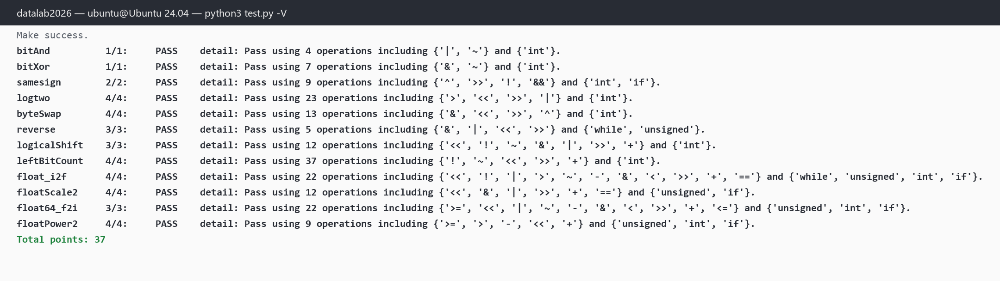

# datalab 报告

姓名：贾雨舟

学号：2025201789

| 总分 | bitAnd | bitXor | samesign | logtwo | byteSwap | reverse | logicalShift | leftBitCount | float_i2f | floatScale2 | float64_f2i | floatPower2 |
| --------- | ------------- | ------------- | ------------- |----------------- |-----------| ----------- | ----------- | ----------- | ----------- | ----------- | ----------- | ----------- |
| 37 / 37 | 1 / 1 | 1 / 1 | 2 / 2 | 4 / 4 | 4 / 4 | 3 / 3 | 3 / 3 | 4 / 4 | 4 / 4 | 4 / 4 | 3 / 3 | 4 / 4 |

test 截图（`python3 test.py -V`）：



## 解题报告

### 亮点

1. leftBitCount：处理了 x 为正数时 `~x` 是负数、二分失效的问题
2. reverse：合法操作符没有比较符，用计数器回绕控制循环
3. logicalShift：n=0 时没有移位 32 位的 UB

### bitAnd / bitXor

德摩根律：`x&y = ~(~x|~y)`，`x^y = ~(x&y) & ~(~x&~y)`。

### samesign

0 单独算一类。两个都为 0 返回 1；恰好一个为 0 返回 0；剩下看符号位，`(x^y)>>31` 为 0 就是同号。

### logtwo

二分找最高位的 1。比较结果是 0/1，`s = ((v>>16)>0)<<4` 得到 16 或 0，s 既加进答案又当移位量。对 8、4、2 重复，最后 `(v>>1)>0` 收尾。

### byteSwap

取出两字节 a、b，`d = a^b`。x 在 n 位和 m 位分别异或 `d<<(8n)`、`d<<(8m)`，两字节交换，其他位不受影响。n=m 时 d=0，结果不变。

### reverse

每轮 `r = (r<<1) | (v&1)`，v 右移一位，做 32 轮。循环条件没法写 `i < 32`，用无符号计数器 m 从 1 开始每轮左移一位，`while (m)`，m 回绕到 0 时刚好做完 32 轮。

### logicalShift

`x>>n` 之后把高 n 位清零。造掩码要用 `1 << (32-n)`，n=0 时移位 32 位是 UB。

```c
int np = n + !n;                    /* n=0 时 np=1，移位量不超过 31 */
int mask = (1 << (33 + ~np)) + ~0;  /* 33+~np = 32-np：低 32-np 位全 1 */
mask = mask | (!n << 31);           /* n=0 时把最高位补回来 */
return (x >> n) & mask;
```

### leftBitCount

对 x 二分：`x>>k == -1` 说明高 k 位全是 1，答案加 k，x 左移 k 位，补进来的 0 挡住计数。先查 16、8、4、2，剩两位各查一次，16+8+4+2+1+1 正好覆盖 32 位。

第一版按"31 − logtwo(~x)"写的：x 为正数时 `~x` 是负数，算术右移符号扩展，高半区的判断全错，btest 用 0x7fffffff 抓出来了。改成对 x 直接二分。

### float_i2f

负数记符号，取绝对值 `~x+1`（unsigned 加法没有 UB）。左移到 1 顶格定指数 e，`frac = (a>>8) & 0x7FFFFF`，剩下 8 位向偶数舍入：大于 0x80 进位，等于 0x80 时尾数末位是 1 才进位。进位到 0x800000 就清零、e+1。最后拼 `sign | (e+127)<<23 | frac`。

### floatScale2

exp=255 原样返回（NaN 题目要求不变，Inf 乘 2 还是 Inf）。exp=0 时 `frac << 1`，尾数最高位顶进阶码，正好是正确的规格化结果。其余 exp+1，加到 255 自然变 Inf。

### float64_f2i

e = exp−1023。e<0 返回 0；e≥31 返回 0x80000000（−2³¹ 就是 INT_MIN，位模式一样）。e≤20 时整数部分全在 uf2 里：`(uf2 & 0xFFFFF) >> (20-e) | (1 << e)`。e 更大时再拼上 uf1 的高 e−20 位。负数取 `~result + 1`。

### floatPower2

2^x 的 frac 恒为 0，按 x 的范围拼位模式：x>127 返回 +Inf；[−126,127] 返回 `(x+127)<<23`；[−149,−127] 返回 `1 << (x+149)`；再小返回 0。

## 反馈/收获/感悟/总结

本机是 Windows，编译测试在我的 Ubuntu 24.04 服务器（gcc 13.3）上做的，-Wall 零警告。花时间最多的是浮点四题，float_i2f 的舍入最麻烦；leftBitCount 的负数 bug 最隐蔽。学到两个技巧：比较式本身是 0/1，可以当移位量用；无符号计数器回绕到 0 可以当循环结束条件。

## 参考的重要资料

- CS:APP 第 2 章（补码、IEEE 754）
- 课程发的《DataLab2026 题目中文讲解》
